# Agentic ML Pipeline — Workflow & Progress Report

Implementation status: **Phases 1 and 2 complete, Phase 3 mostly complete, Phases 4 and 5 pending.**
Backend test suite: 80 passing (63 pre-existing + 17 new in `backend/tests/test_agentic_loops.py`).

## 1. The agentic workflow

```mermaid
flowchart TD
    S([Upload + start run]) --> P1[Profiling agent]
    P1 --> PD["Problem detection<br/>LLM investigator + tools<br/>(fallback: heuristics)"]
    PD --> G1{{"HITL 1<br/>always human"}}
    G1 -- reject + reason --> PD
    G1 -- approve --> BF[Business framing + Data validation]
    BF --> G2{{"HITL 2<br/>auto if confident & no critical risk"}}
    G2 --> CL["Cleaning plan agent<br/>confidence from plan contents"]
    CL --> G3{{"HITL 3"}}
    G3 -- reject + reason --> CL
    G3 --> TR["Transformation agent<br/>LLM investigator + tools<br/>(fallback: rules)"]
    TR --> G4{{"HITL 4"}}
    G4 -- reject + reason --> TR
    G4 --> SP[Train/test split agent]
    SP --> G5{{"HITL 5"}}
    G5 -- reject + reason --> SP
    G5 --> AL["Algorithm selection agent<br/>LLM + feedback (fallback: rules)"]
    AL --> G6{{"HITL 6"}}
    G6 -- reject + reason --> AL
    G6 --> TRN[Train all shortlisted models]
    TRN --> HPO[Hyperparameter optimisation]
    HPO --> EV[Evaluation summary]
    EV --> QC{"Quality-check agent<br/>metric above the bar?"}
    QC -- "no, retries left:<br/>broaden algorithms, then swap scaler" --> TRN
    QC -- "yes, or retries exhausted / leakage suspected" --> CR["Critic agent<br/>independent risk review"]
    CR --> RC[Recommendation agent]
    RC --> G7{{"HITL 7<br/>always human"}}
    G7 --> FIN[Refit champion + Reporting agent]
    FIN --> E([Completed])
```

Two loops make it agentic rather than a linear pipeline:

* **Revision loop (human to agent).** Rejecting a proposal at a revisable gate no longer ends the run.
  The same agent re-proposes with the rejected proposal and the reviewer's reason as feedback.
  Bounded to 2 revisions per stage. A revised proposal always goes back to a human.
* **Self-correction loop (agent to agent).** After evaluation, the quality-check agent decides whether the
  model is good enough. If not, it applies a remedy and retrains with no human involved, up to 2 times.
  Every attempt is recorded as an `AgentDecision`. The final human gate is still mandatory.

## 2. Phase status

| # | Phase | Status | What shipped |
|---|-------|--------|--------------|
| 1 | Productive rejection + real confidence | **Done** | Revision loop through LangGraph conditional edges from each revisable gate (`pipeline_graph.py`). `feedback` support in the problem-detection, cleaning, transformation, split and algorithm agents (`feedback_utils.py`). Router re-dispatches instead of failing (`routers/pipeline.py`). Hard-coded confidences replaced by signal-derived scores with a `confidence_factors` audit list. |
| 2 | Closed loop + critic | **Done** | `quality_check_agent.py` (bounded retry, remedies `broaden_algorithms` then `alternate_scaling`, leakage smell is flagged not retried). `critic_agent.py` (leakage, unresolved weak signal, near-tie, small data, data-quality flags). Critic findings are attached to the recommendation the human reviews. |
| 3 | Real reasoning + tools | **Mostly done** | Tool-calling loop `llm_service.run_tool_loop` with adapters for **Gemini**, Anthropic and OpenAI. Read-only dataset tools (`dataset_tools.py`: column stats, value counts, outlier report, leakage probe). LLM-with-fallback problem detection and transformation. Algorithm agent takes feedback. Guardrails: the LLM cannot change dtype-derived problem type, cannot repeat a rejected choice, can only lower confidence, and any failure falls back to the deterministic result. |
| 4 | Capability expansion | Pending | Feature-engineering agent, imbalance handling, adaptive HPO budget, chat that triggers gated actions. |
| 5 | Productionisation | Pending | Job queue (Celery/RQ), Postgres, object storage, auth, drift/monitoring agent, cross-run memory, agent-quality eval harness. |

### Pending inside Phase 3
* Cleaning-plan agent is still rules-only (its per-column action schema needs stricter LLM output validation).
* Evaluation and recommendation agents are still rules-only; the critic's narrative is the only LLM text there.
* Tool loop has not been exercised against a live Gemini key in this environment. It is covered with a scripted fake
  provider, and the Gemini tool declaration is confirmed to be accepted by the installed SDK.

## 3. Using it with Gemini

Set `GEMINI_API_KEY` in the backend environment. Provider order is Anthropic, then Gemini, then OpenAI, so leave
the other two keys unset. With no key set, every agent uses its deterministic path and nothing breaks.
`google-generativeai` (already a dependency) is deprecated upstream; migrating to `google.genai` is a future task.

## 4. Where things live

| Concern | File |
|---------|------|
| Graph, loops, gates | `backend/app/agents/pipeline_graph.py` |
| Revision history, bounds | `backend/app/services/agent_decision_service.py` |
| Feedback parsing | `backend/app/agents/feedback_utils.py` |
| Self-correction | `backend/app/agents/quality_check_agent.py` |
| Critic | `backend/app/agents/critic_agent.py` |
| Tool loop (Gemini/Anthropic/OpenAI) | `backend/app/services/llm_service.py` |
| Dataset tools | `backend/app/agents/dataset_tools.py` |
| LLM agents | `problem_detection_llm.py`, `transformation_llm.py`, `algorithm_selection_llm.py` |
| Tests | `backend/tests/test_agentic_loops.py` |
